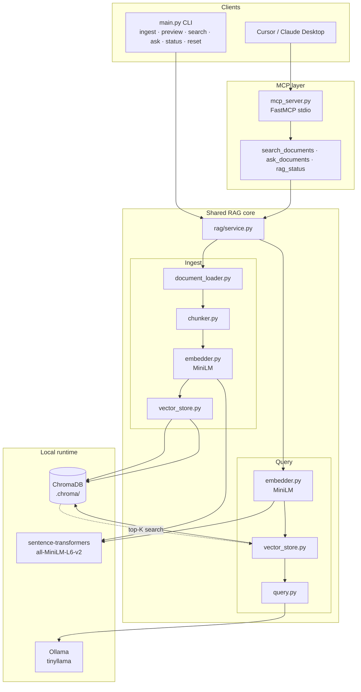
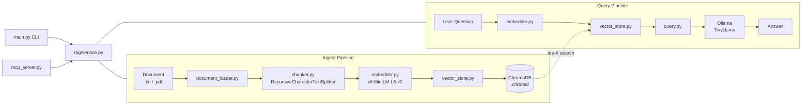

# local-rag-mcp-minilm — Architecture

Visual diagram: [local-rag-mcp-architecture-diagram.png](./local-rag-mcp-architecture-diagram.png)

## Overview

A fully local RAG pipeline with two entry points (CLI and MCP). Documents are split with
recursive chunking, embedded via `all-MiniLM-L6-v2` (sentence-transformers), stored in
ChromaDB, and queried with Ollama TinyLlama for grounded answers. Cursor connects over
MCP stdio and calls the same business logic as the CLI.

## System diagram



## Ingest pipeline

```
Document (.txt / .pdf)
        │
        ▼
document_loader.py     ← extract text (pypdf for PDFs)
        │
        ▼
chunker.py             ← RecursiveCharacterTextSplitter (500 / 50)
        │
        ▼
embedder.py            ← all-MiniLM-L6-v2 (384-dim vectors)
        │
        ▼
vector_store.py        ← ChromaDB (.chroma/)
```

**CLI:** `python main.py ingest <file>`

MiniLM downloads from Hugging Face on first embed (~80 MB). Ollama is not required for ingest.

## Query pipeline

### Search (retrieval only)

```
User question
        │
        ▼
embedder.py            ← embed query (MiniLM)
        │
        ▼
vector_store.py        ← top-K similarity search
        │
        ▼
Matching chunks + source excerpts
```

**CLI:** `python main.py search "<question>"`  
**MCP:** `search_documents` — no LLM call

### Ask (full RAG)

```
User question
        │
        ▼
embedder.py            ← embed query (MiniLM)
        │
        ▼
vector_store.py        ← top-K similarity search
        │
        ▼
query.py               ← build prompt with retrieved chunks
        │
        ▼
Ollama TinyLlama       ← generate grounded answer
        │
        ▼
Answer + source excerpts
```

**CLI:** `python main.py ask "<question>"`  
**MCP:** `ask_documents` — requires Ollama running

## Preview (no embeddings)

```
Document → document_loader.py → chunker.py → print chunks
```

**CLI:** `python main.py preview <file>` — tune splits before indexing.

## MCP layer

```
Cursor chat
        │
        ▼
~/.cursor/mcp.json     ← launches mcp_server.py via stdio
        │
        ▼
mcp_server.py          ← FastMCP tool handlers
        │
        ▼
rag/service.py         ← same logic as CLI
        │
        ├── search_documents  → MiniLM + ChromaDB only
        ├── ask_documents     → MiniLM + ChromaDB + Ollama
        └── rag_status        → chunk count + source file list
```

Ingest remains CLI-only in v1: `python main.py ingest data/sample.txt`

## Components

| Module | Responsibility |
|--------|----------------|
| `main.py` | CLI: ingest, preview, search, ask, status, reset |
| `mcp_server.py` | FastMCP tools for Cursor / Claude Desktop |
| `rag/service.py` | Shared business logic for CLI and MCP |
| `rag/config.py` | Models, chunk size, overlap, top-K, paths |
| `rag/document_loader.py` | Load `.txt` / `.pdf`, call chunker |
| `rag/chunker.py` | `RecursiveCharacterTextSplitter` wrapper |
| `rag/embedder.py` | `all-MiniLM-L6-v2` via sentence-transformers |
| `rag/vector_store.py` | ChromaDB persist + similarity search |
| `rag/query.py` | Retrieve chunks, prompt LLM, format sources |

## External services (local)

| Service | Model / store | Role |
|---------|---------------|------|
| sentence-transformers | `all-MiniLM-L6-v2` | Text → 384-dim vectors |
| Ollama | `tinyllama` | Context → answer |
| ChromaDB | `.chroma/` on disk | Vector storage + search |

## Data flow summary

| Step | Embedding model | LLM | Storage |
|------|-----------------|-----|---------|
| Ingest | MiniLM | — | ChromaDB |
| Search | MiniLM | — | ChromaDB read |
| Ask | MiniLM | TinyLlama | ChromaDB read |

## Mermaid — ingest and query


