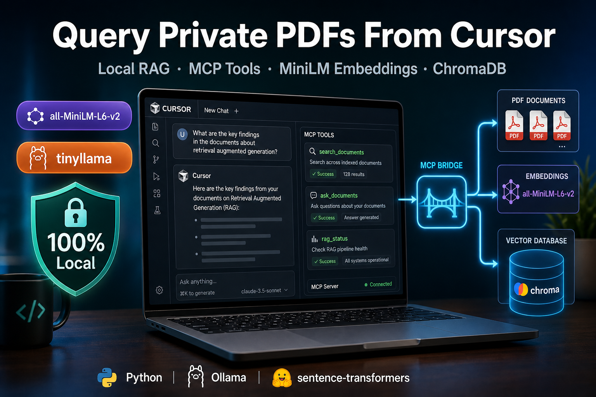
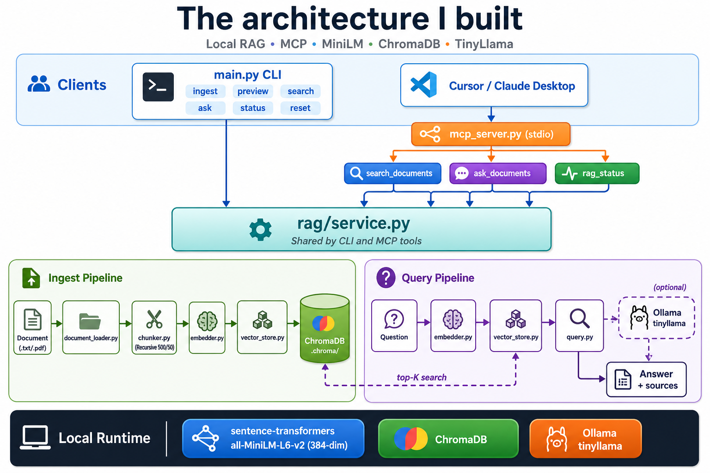

# I Turned My Local RAG Into an MCP Server — and Swapped in MiniLM Embeddings on My Laptop



In my [first article](https://medium.com/towards-artificial-intelligence/i-built-a-private-ai-that-answers-questions-from-my-own-pdfs-entirely-on-my-laptop-3b4122daa946), I built a local RAG system that answers questions from my own PDFs using Ollama, ChromaDB, and TinyLlama.

In my [second article](https://medium.com/p/7c0138877913), I improved retrieval by switching from fixed-size chunking to recursive chunking with overlap.

Both projects worked well from the terminal. I could ingest a document and ask questions. But I kept running into the same friction:

I had to leave my editor, open a terminal, copy questions back and forth, and remember which commands to run.

That led me to my next experiment: expose the same RAG pipeline as an **MCP server** so Cursor can query my private documents as tools — while also trying a different local embedding model, **all-MiniLM-L6-v2**, instead of Ollama for search vectors.

This article is about what I built, how MCP fits in, and what changed when embeddings moved from Ollama to sentence-transformers.

## What is MCP, in plain English?

**MCP** stands for Model Context Protocol.

Think of it like a standard plug for AI tools. Instead of every app inventing its own way to call your code, MCP gives assistants like Cursor a consistent way to discover and invoke **tools** you define — search a database, read a file, call your RAG pipeline.

For this project, MCP is the bridge between:

- **Cursor chat** — where you ask questions in natural language
- **Your local RAG code** — ingest, search, and answer from your own indexed PDFs

You still own the data. It still runs on your machine. Cursor just gets a clean way to call it.

## Why I cared about this

My earlier RAG demos were CLI-first. That is great for learning. It is less great when you are already inside an IDE and want answers from an internal PDF without context switching.

I wanted three things:

1. **Keep everything local** — no cloud API, no documents leaving my laptop
2. **Reuse my RAG logic** — not a rewrite, just a new entry point
3. **Learn MCP hands-on** — a practical step toward agent-style workflows

So I built a third project that adds:

- A shared **service layer** (`rag/service.py`) used by both CLI and MCP
- An **MCP server** (`mcp_server.py`) with three tools
- **MiniLM embeddings** via Hugging Face instead of Ollama `nomic-embed-text`

Same recursive chunking. Same ChromaDB. Same TinyLlama for answers. New interfaces and a new embedding path.

## What changed from my earlier RAG projects

| Piece | Previous Articles | This Article |
|-------|----------------|--------------|
| Embeddings | Ollama `nomic-embed-text` | Hugging Face `all-MiniLM-L6-v2` |
| Chat model | Ollama `tinyllama` | Ollama `tinyllama` |
| Chunking | Fixed (v1) → Recursive + overlap (v2) | Recursive + overlap |
| Interface | CLI only | CLI + MCP server |
| Vector index | Per-project `.chroma/` | Fresh 384-dim MiniLM index |

**Important:** do not reuse an old `.chroma/` folder when you switch embedding models. Different models produce different vector sizes. Mixing them breaks search.

## Two models, two jobs (plus MCP)

A common point of confusion in RAG: you usually need **more than one model**.

### 1. Embedding model — all-MiniLM-L6-v2

This model does not write answers. It converts text into numbers (vectors) that capture meaning.

In my first two projects, I pulled embeddings through Ollama. Here I use **sentence-transformers** instead:

- Downloads once from Hugging Face (~80 MB)
- Runs locally in Python — no Ollama needed for ingest or search
- Produces **384-dimensional** vectors
- Fast on CPU for learning-sized documents

When you ask *"What is the MFA policy?"* and your document says *"Multi-Factor Authentication must be configured before access is granted"*, the embedding model helps the system understand those are related — even when the words differ.

### 2. Chat model — TinyLlama (Ollama)

TinyLlama is still only ~1.1B parameters. It is not GPT-4. For learning and simple Q&A on your own docs, it is enough.

It is used only when you want a **written answer** — CLI `ask` or MCP `ask_documents`.

### 3. MCP tools — the new interface

Instead of typing terminal commands, Cursor can call:

| Tool | What it does | Needs Ollama? |
|------|----------------|---------------|
| `rag_status` | Chunk count + indexed file names | No |
| `search_documents` | Return top matching chunks (no LLM) | No |
| `ask_documents` | Full RAG answer with source excerpts | Yes |

That split matters. **Search** is fast and great for debugging retrieval. **Ask** adds the LLM on top.

## A real example: search vs ask

Suppose I indexed an internal policy PDF and asked:

*"What happens if I don't link my account to SSO?"*

**Step 1 — `search_documents` (retrieval only)**

The tool returns the top chunks with source file, chunk index, and a short excerpt. I can verify retrieval found the right section — without trusting an LLM summary.

**Step 2 — `ask_documents` (full RAG)**

The same question goes through retrieval, then TinyLlama writes an answer grounded in those chunks. I also get source excerpts so I can spot when the small model adds extra detail not in the text.

That workflow taught me something my earlier CLI-only projects did not surface as clearly: **always look at retrieved chunks before blaming the model.**

## The architecture I built

I kept the pipeline small and added a shared service layer plus MCP on top.



```
                    ┌─────────────────────────────────────────┐
                    │           rag/service.py                │
                    │     (shared by CLI and MCP tools)       │
                    └─────────────────────────────────────────┘
                           ▲                    ▲
              ┌────────────┘                    └────────────┐
              │                                              │
       main.py CLI                              mcp_server.py (stdio)
   ingest · preview · search · ask          search_documents · ask_documents · rag_status
              │                                              │
              └──────────────────┬───────────────────────────┘
                                 ▼
Document → recursive chunker → MiniLM embed → ChromaDB (.chroma/)
Question → MiniLM search → top-K chunks → [optional] Ollama tinyllama → answer
```

| Component | Role |
|-----------|------|
| sentence-transformers (MiniLM) | Turn text into vectors for search |
| Ollama (TinyLlama) | Generate answers from retrieved context |
| ChromaDB | Store and search vectors locally |
| RecursiveCharacterTextSplitter | Split text at natural boundaries |
| FastMCP | Expose RAG as tools to Cursor |

Total footprint: still laptop-friendly. MiniLM is ~80 MB. TinyLlama is ~1 GB. No Docker required.

Full diagrams: see `docs/architecture.md` in the repo.

## How the pipeline works

### Step 1: Ingest a document (CLI)

Document (.txt or .pdf) → extract text → recursive split with overlap → MiniLM embed → store in ChromaDB

I use ~500-character chunks with 50-character overlap — same tuning as my chunking article. First ingest downloads MiniLM automatically.

Ollama is **not** required for this step.

### Step 2: Preview or search (optional, no LLM)

**Preview:** see how a file splits before embedding anything

```
python main.py preview data/sample.txt
```

**Search:** test retrieval without calling TinyLlama

```
python main.py search "What embedding model does this project use?"
```

From Cursor, the same idea is:

```
Use search_documents to find chunks about SSO linking
```

### Step 3: Ask a question (CLI or MCP)

Question → MiniLM embed → top-K similarity search → prompt TinyLlama → answer + sources

CLI:

```
python main.py ask "What MCP tools are available?" --show-sources
```

Cursor:

```
Use ask_documents: What MCP tools are available?
```

### Step 4: Connect MCP in Cursor

1. Ingest at least one document via CLI first
2. Add the server to `~/.cursor/mcp.json`
3. Restart Cursor
4. Call `rag_status`, `search_documents`, or `ask_documents` from chat

Ingest stays CLI-only in v1 — simple and safe for a first MCP article.

## The core code

### Embeddings with MiniLM

The main embedding change is in `rag/embedder.py`:

```python
from sentence_transformers import SentenceTransformer

from rag.config import EMBED_MODEL

_model = None

def _get_model() -> SentenceTransformer:
    global _model
    if _model is None:
        _model = SentenceTransformer(EMBED_MODEL)
    return _model

def embed_texts(texts: list[str]) -> list[list[float]]:
    if not texts:
        return []
    model = _get_model()
    vectors = model.encode(texts, convert_to_numpy=True, show_progress_bar=False)
    return vectors.tolist()
```

Model name and chunk settings live in one place — `rag/config.py`:

```python
EMBED_MODEL = "all-MiniLM-L6-v2"
LLM_MODEL = "tinyllama"
CHUNK_SIZE = 500
CHUNK_OVERLAP = 50
TOP_K = 4
```

### MCP tools with FastMCP

The MCP server reuses the same service functions as the CLI:

```python
from mcp.server.fastmcp import FastMCP
from rag import service

mcp = FastMCP("local-rag-mcp-minilm")

@mcp.tool()
def search_documents(question: str, top_k: int = 4) -> dict:
    """Search indexed documents and return matching chunks (no LLM answer)."""
    result = service.search_documents(question, top_k=top_k)
    return {"ok": True, **result}

@mcp.tool()
def ask_documents(question: str, top_k: int = 4) -> dict:
    """Ask a question and get an answer grounded in indexed documents."""
    result = service.ask_documents(question, top_k=top_k)
    return {"ok": True, **result}

@mcp.tool()
def rag_status() -> dict:
    """Return how many chunks are indexed and which source files exist."""
    result = service.get_index_status()
    return {"ok": True, **result}
```

Roughly **50 lines** of MCP wiring on top of RAG code I already understood. That was the surprise — MCP felt abstract until I mapped three CLI operations to three tools.

### Cursor MCP config

Add this to `~/.cursor/mcp.json` (adjust paths for your machine):

```json
{
  "mcpServers": {
    "local-rag-mcp-minilm": {
      "command": "C:\\path\\to\\local-rag-mcp-minilm\\.venv\\Scripts\\python.exe",
      "args": ["C:\\path\\to\\local-rag-mcp-minilm\\mcp_server.py"]
    }
  }
}
```

Restart Cursor. The tools show up in chat.

## What the CLI looks like

The app is still command-line driven for ingest and testing:

```
# Preview how a document is split (no model download needed)
python main.py preview data/sample.txt

# Index a text or PDF file (downloads MiniLM on first run)
python main.py ingest data/sample.txt

# Search without calling the LLM
python main.py search "What is all-MiniLM-L6-v2?"

# Ask a question
python main.py ask "What MCP tools are available?"

# Show retrieved sources with the answer
python main.py ask "What is recursive chunking?" --show-sources

# Check status
python main.py status

# Clear the vector store
python main.py reset
```

That is it. No web server. No cloud API. MCP is an extra entry point — not a replacement for the CLI while learning.

## Project structure

I organized the code into small, focused modules:

```
local-rag-mcp-minilm/
├── main.py                 # CLI: ingest, preview, search, ask, status, reset
├── mcp_server.py           # FastMCP tools for Cursor
├── requirements.txt
├── README.md
├── docs/
│   └── architecture.md     # Diagrams and pipeline breakdown
├── rag/
│   ├── config.py           # models, chunk size, overlap, top_k
│   ├── chunker.py          # RecursiveCharacterTextSplitter
│   ├── document_loader.py  # .txt and .pdf support
│   ├── embedder.py         # all-MiniLM-L6-v2
│   ├── vector_store.py     # ChromaDB
│   ├── query.py            # Retrieve + generate + source excerpts
│   └── service.py          # Shared logic for CLI + MCP
├── examples/
│   └── cursor-mcp.json     # MCP config snippet
└── data/
    └── sample.txt          # Demo document
```

Each file has one responsibility. The **`service.py`** layer is the key design choice — CLI and MCP both call the same functions, so behavior stays in sync.

## Ollama embeddings vs MiniLM — what I noticed

Both approaches keep data local. The difference is *where* embedding happens.

| | Ollama `nomic-embed-text` | `all-MiniLM-L6-v2` |
|--|---------------------------|---------------------|
| Setup | `ollama pull nomic-embed-text` | `pip install sentence-transformers` |
| Runtime | Ollama server | Python library |
| Good for | One stack for embed + chat | Fast local prototypes, common in tutorials |
| Index | Its own vector dimensions | 384-dim — separate `.chroma/` |

For this article series, MiniLM was worth it because it showed me **RAG does not require every model to come from the same place**. Embed with Hugging Face. Chat with Ollama. Store with ChromaDB. Still 100% local.

## What I learned building this

1. **MCP is simpler than the hype suggests.** If you already have working functions, tools are mostly wrappers with descriptions. Start with read-only tools like `search_documents` and `rag_status`.

2. **A service layer pays off immediately.** Without `rag/service.py`, I would have duplicated ingest and query logic between CLI and MCP. One shared module kept the project small.

3. **Search and ask are different products.** Exposing both as MCP tools made retrieval debugging much easier. Search shows what the index actually found. Ask adds LLM synthesis on top.

4. **Small LLMs need source checking.** TinyLlama sometimes smooths or blends details. Returning source excerpts alongside answers (`--show-sources` / MCP JSON) helped me trust the pipeline more.

5. **Embedding model choice is a fresh index.** Switching from Ollama embeddings to MiniLM meant re-ingesting documents. That is expected — not a bug.

## Who is this for?

This kind of project is great if you are:

- Building on local RAG from my earlier articles
- Learning **MCP** with a real project, not a hello-world only
- Exploring **sentence-transformers** as an alternative to Ollama embeddings
- Using **Cursor** and want your private docs callable as tools
- Preparing for interviews where RAG, embeddings, and tool calling come up

You do not need a GPU farm. You need Python, Ollama (for `ask` only), and at least one document to index.

## What is next?

From here, the natural extensions in this series are:

- **Hybrid RAG** — combine keyword search (BM25) with vector similarity
- **Ingest via MCP** — with path allowlists for safety
- **Conversation memory** — multi-turn questions across chat sessions
- **Stronger local chat model** — swap TinyLlama for phi3:mini or similar
- **Source-first answers** — return chunks only unless the user explicitly asks for synthesis

But even in its current form, this project already shows the core lesson: **your RAG pipeline can be a tool, not just a script.**

## Final thought

My first RAG article taught me the loop — ingest, embed, retrieve, generate.

My second taught me that retrieval quality starts with chunking.

This one taught me that once the loop works, the next step is making it **callable** — from your IDE, through MCP, on your own machine, on your own documents.

If you are starting with MCP and RAG together, my advice is the same as before: build the smallest version first. Ingest one PDF. Call `rag_status`. Run `search_documents` on one question. Then try `ask_documents`. Compare the chunks to the answer.

That one end-to-end pass teaches more than reading ten protocol diagrams.

You can download the complete source code from GitHub: https://github.com/parivshah/local-rag-mcp-minilm

The repository includes setup instructions, architecture diagrams, and an MCP config example. Please let me know if you liked this article or have any questions, feedback, or suggestions. You can connect with me on [LinkedIn](https://www.linkedin.com/in/parivshah).

---

**Suggested title (Medium / Towards AI):**  
*I Turned My Local RAG Into an MCP Server — Query Private PDFs From Cursor on My Laptop*

**Suggested LinkedIn post (shorter hook):**  
Article 3 in my local RAG series: same private PDF pipeline, now exposed as MCP tools in Cursor — plus MiniLM embeddings instead of Ollama for search vectors. CLI + MCP + ChromaDB + TinyLlama, still 100% on my laptop. Link in comments.

**Tags:** RAG, MCP, Local AI, Ollama, Cursor, ChromaDB, sentence-transformers, MiniLM, Python
